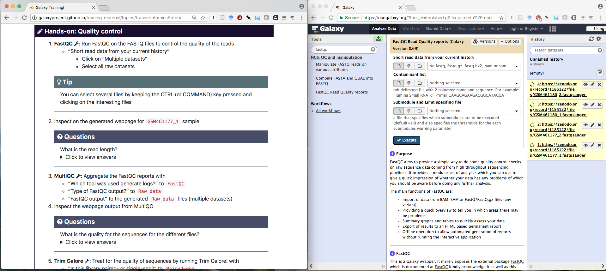

1. TOC
{:toc}

# Overview Questions

## What is this website?

This website is a collection of hands-on tutorials that are designed to be interactive:

This material is developed and maintained by the [VIB Bioinformatics Core](https://www.bits.vib.be/).

## What are the tutorials for?

These tutorials can be used for learning and teaching how for general data analysis, and for learning/teaching specific domains such as metagenomcis and differential gene expression analysis with RNA-Seq data.

## What audiences are the tutorials for?

There are two distinct audiences for these materials.

1. **Self-paced individual learners.** These tutorials provide everything you need to learn a topic, from explanations of concepts to detailed hands-on exercises.
2. **Instructors.** They are also designed to be used by instructors in teaching/training settings. Slides, and detailed tutorials are provided.

## How is the content licensed?

The content of this website is licensed under the [Creative Commons Attribution 4.0 License](https://creativecommons.org/licenses/by/4.0/).

## How can I advertise the training materials on my posters?

We provide some QR codes and logos in the [images folder]({{ site.github.repository_url }}/tree/{{ site.repository_branch }}/assets/images).

## How do I use this material?

Many topics include slide decks and if the topic you are interested in has slides then start there.  These will introduce the topic and important concepts.

## How can I get help?

If you have questions about this training material, you can reach us sending an email to bits@vib.be.

# For Instructors

This material can also be used to teach the content in a group setting to students and researchers.

## Where do I start?

Spend some time exploring the different tutorials and the different resources that are available. Become familiar with the structure of the tutorials and think about how you might use them in your teaching.

## How can I fix mistakes or expand an existing tutorial using the GitHub interface?

Check our tutorial to learn how to use the GitHub interface (soon...)

## Sustainability of the training-material and metadata

This repository is hosted on [GitHub](https://github.com/) using git as a [DVCS](https://en.wikipedia.org/wiki/Distributed_version_control). Therefore the community is hosting backups of this repository in a decentralised way. The repository is self-contained and contains all needed content and all metadata.
In addition we mirror snapshops of this repo on [Zenodo](http://zenodo.org).
