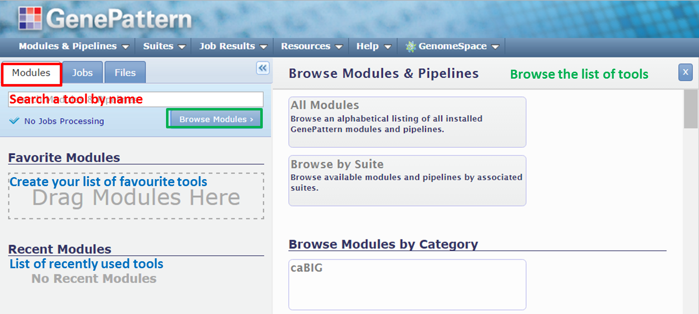
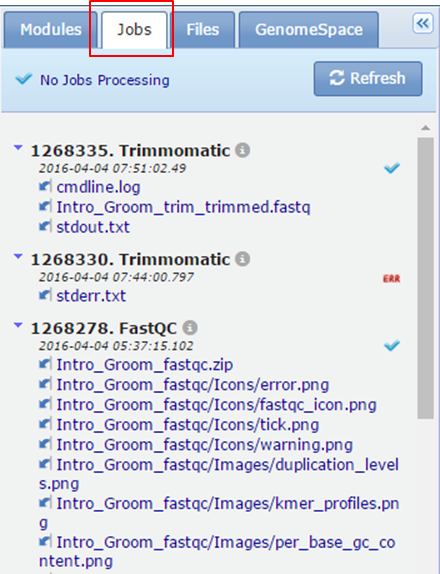
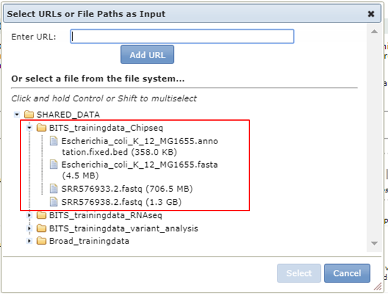

## Introduction to GenePattern

### Access GenePattern

You can work on our [BITS Genepattern server](https://dev.bits.vib.be:8686/gp/pages/index.jsf). Ask the trainer for login details.

### The GenePattern user interface

Logging in brings you to the GenePattern homepage: 

- Click the GenePattern icon at the top of the page (red) to return to this home page at any time.
- The upper right corner shows your user name (green).
- The navigation tabs (blue) provide access to other pages.

We'll zoom in on the navigation tabs: 

- The Modules tab gives access to the tools that you can run. Enter the first few characters of a module in the search box to locate a tool. Click the Browse modules button to list the tools.

- The Jobs tab shows an overview of the analyses that you have done by showing the tools that you have run, together with a list of output files that were generated.

- The **Files** tab shows a list of files you can use as input for the tools. These are files that you have uploaded from your hard drive or files that were generated as the output of a tool and that were saved to the **Files** tab. In your case the Files tab contains a folder **uploads**. 

### Searching a tool in GenePattern

You can find a module by typing its name into the search box on the **Modules** tab: 

Searching a tool makes its name appear in the main window.

### Running tools in GenePattern

Clicking the name of the tool will open its parameter form in the main window.

Fill in the parameters and click **Run** to start the analysis.

As long as the tool is running you see an arched arrow in the top right corner: 

When the tool has finished the arched arrow is replaced by a checkmark and the file(s) containing the results appear at the bottom: 

Note that apart from the file containing the results, other files are generated e.g. stdout.txt containing the error log of the tool. You can consult the error log in case of problems.

#### Check the documentation

To obtain a description of the parameters of a tool and their default values click the Documentation link at the top of the page. 

#### Define input files

Many input files are located in the shared data folder. In the parameter form of a tool, you will find the **Add Paths** or **URLs button** in the **input files** section: 

Click the button and expand **BITS trainingdata Chipseq**: 

### Store the output of a tool in GenePattern 

Copy the file in the uploads folder on the Files tab to store it permanently and allow to use it as input for other tools. Output files that are not saved in the uploads folder are stored 7 days on the server and are visible via the Jobs tab.

When a tool has finished output files are generated at the bottom of the page. 

- Click the name of the output file. 

- Select Copy to Files Tab

