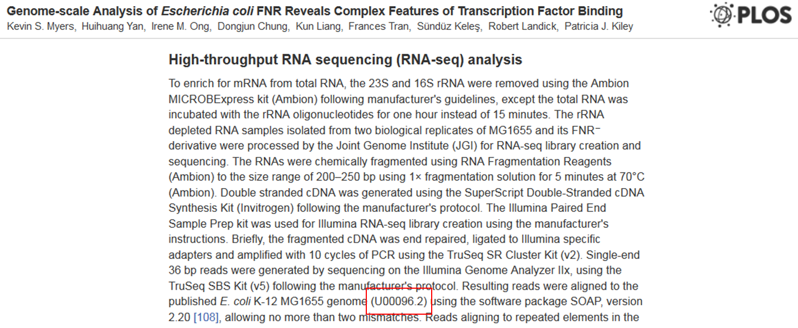
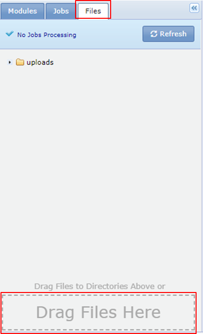
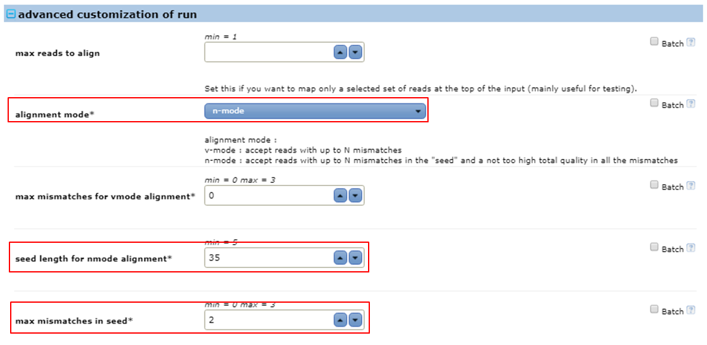

## Mapping reads with Bowtie

Exercise created by Morgane Thomas Chollier

### Obtaining the reference genome

In the ChIP-Seq experiment of *E. coli* we want to see which genomic regions are bound to transcription factor FNR. However, at this point what we have is a set of reads that are identified by their location on the flow cell. To answer our question we should link the reads to regions in the genome to obtain their genomic coordinates. This process is called mapping.
For Illumina reads the standard mappers are BWA and Bowtie (version 1 and 2).

> Which version of Bowtie are we going to use?
> We will use Bowtie version 1 as this version was designed for mapping short reads (< 50nt) and our reads are short (36nt).

The Bowtie_1 aligner is installed on GenePattern. Check the documentation on GenePattern or read [the manual on the Bowtie website](http://bowtie-bio.sourceforge.net/manual.shtml).

Bowtie needs the complete genome, in FASTA format as a reference sequence to align the reads to.

> Which *E. coli* strain was used in the experiment?
> Go to [the paper](http://journals.plos.org/plosgenetics/article?id=10.1371/journal.pgen.1003565) and check the part **Strains and growth conditions** in the **Materials and methods** section. There you see that the experiment was done using *E. coli* K-12 MG1655.

 for bowtie. Several pre-built indexes are available to download on [the bowtie webpages](http://bowtie-bio.sourceforge.net/manual.shtml) or the [iGenomes website](http://support.illumina.com/sequencing/sequencing_software/igenome.html).
Although the *E. coli* sequence is available we will not use it to show you how you should proceed if you don't find your reference sequence on this website. In that case you will need to make the index yourself. 

If you can't find your reference on the iGenomes website you have to download it from:
- [UCSC](http://genome.ucsc.edu/)
- [Ensembl](http://www.ensembl.org/index.html)
- [NCBI](http://www.ncbi.nlm.nih.gov/)

Since Ensembl focuses on higher eukaryotes, we are going to download the genome from NCBI.

> Which reference sequence was used in the experiment ?  
> Go to [the paper](http://journals.plos.org/plosgenetics/article?id=10.1371/journal.pgen.1003565) and check the part **High-throughput RNA sequencing (RNA-seq) analysis**. There you see that the reads were mapped to an NCBI sequence with accession number **U00096**.

> Search for this sequence on NCBI ?  
> Go to [the NCBI website](http://www.ncbi.nlm.nih.gov/), select the **Nucleotide** database, type **U00096** as a search term and click **Search**.

NCBI Nucleotide is notorious for the amount of errors it contains both in sequences and in annotations. Therefore, if available you should always use sequences from RefSeq, the clean subset of NCBI’s Nucleotide database. This sequence is not a RefSeq sequence. You can see that because the accession number does not contain an underscore and all RefSeq accession numbers contain an underscore.

> Is there a RefSeq sequence available ?  
> In [the Nucleotide record](http://www.ncbi.nlm.nih.gov/nuccore/U00096.3), scroll down to the **Related information** section in the right menu. There you see that a RefSeq sequence is available. Click the **Identical RefSeq** link. 

This brings us to a RefSeq record with accession number NC_000913.

> Download the sequence of the RefSeq record in FASTA format  
> 

- In the record expand the **Send to** section (red).
- Select **File** as destination (green). This means that you download the data on your computer.
- Select **FASTA** format (blue).
- Click **Create File**.

If all goes well you should see the following message” => the message is “sequence.fasta. This creates a file called **sequence.fasta** in the **Downloads** folder of your computer. 

> Upload the downloaded file to your **Uploads** folder in GenePattern. 
> 
- Go to the **Files** tab in GenePattern.
- Drag and drop the file onto the **Drag Files Here** section.
- Select the **Uploads** folder and click **Select**

If all goes well you should see the following message

If the upload takes too long use the fasta file from the **SHARED_DATA** folder in GenePattern.

### Indexing the reference genome

You cannot do the mapping directly on the .fasta file, you need to index the file first. Reference genomes from the Bowtie/iGenomes website are already indexed so when you get your reference there you can skip this step. Reference genomes downloaded from NCBI, Ensembl or UCSC need to be indexed using the Bowtie_1 indexer tool.  
Indexing a reference genome is a one-time effort: you do not have to repeat it each time you do a mapping.  
Check the documentation of the Bowtie_1 indexer to see the parameters it takes. The documentation shows that you need to specify: 
- the reference genome that you want to index as an input (in our case the *E. coli* fasta file)
- the name of the indexed output file

Give the output file the same name as the input file: **Escherichia_coli_K12**. The Bowtie indexer will generate a zip file containing a whole set of .ebwt files whose name all start with Escherichia_coli_K12.
Copy the zip-file to your **Uploads** folder.

### Mapping the reads

Open the Bowtie_1 aligner parameter form. 

> Use the indexed E.coli genome for mapping
> The first parameter of the Bowtie 1 aligner parameter form are the genome index files (= the zipped ebwt files in your **Uploads** folder). 
- Go to the **Files** tab
- Click the **Upload your own file** button in the **bowtie1 index** section of the bowtie 1 parameter form
- Drag and drop the zip file to the **Drag your files here** section

> How to define the input file(s) ?
> Bowtie needs an input file containing the reads (in our case SRR576933.fastq). Bowtie can map single end reads like we have but also paired end reads. In the case of paired end reads you have two fastq files, one with the upstream reads and one with the downstream reads. That's why you can specify two input files: **reads pair 1** and **reads pair 2**. We just select **SRR576933.fastq** from the **SHARED_DATA** folder as input for **reads pair 1**.

You need to tell bowtie what type of file your input file is.

> What is the parameter for doing this ?
> Via the parameter called **input format** you can specify that the input file is in fastQ format.
FastQ is the default, so you don't have to explicitly set this option.

Bowtie has two modes of mapping. The simplest strategy is called v-mode alignment: you align complete reads (from the first to the last base aka end-to-end) to the reference and you count the number of mismatches in this alignment. In this mode quality values are ignored and you need to tell bowtie the maximum number of mismatches you allow.  

> Do a v-mode mapping allowing 2 mismatches in the alignments.
> - Expand the **advanced customization of run** parameters
> - Set **alignment mode** to **v-mode**
> - Set **max mismatches for vmode alignment** to **2** it means that bowtie will allow two mismatches anywhere in the alignments. The value for this parameter must be a number from 0 through 3.

Remember because the base quality at the 3'end of the reads is lower, base calls at the 3'ends are often incorrect. This will inevitably lead to mismatches in the alignments. Reads with more than 2 mismatches will not be reported. To avoid losing too many reads during the mapping we can either trim low quality bases from the 3' ends of the reads before the alignment is done or use a mapping strategy that takes into account the quality scores of the bases.

This strategy is called n-mode alignment. It's the default mode. It aligns seeds, the first N bases of the reads at the high quality 5'end, to the reference. You have to set the length of the reads and the maximum number of mismatches allowed in the seed alignment. Additionally the sum of the quality scores at all mismatched positions (not just in the seed) is calculated and you can set a maximum for this parameter. In this way, reads with mismatches with high quality scores will not be reported whereas mismatches with low scores are more or less ignored.

The FASTQC report showed that the last base is of low quality. Since the reads are 36 bases ling we could use seeds of 35 bases for the mapping.

> Do an n-mode mapping with seeds of 35 bases allowing 2 mismatches in the seeds.
> - Expand the **advanced customization of run** parameters
> - Set **alignment mode** to **n-mode**
> - Set **seed length for nmode alignment** to **35**
> - Set **max mismatches in seed** to **2** it means that bowtie will allow two mismatches in the alignments of the seeds (the first 35 bases of the reads) to the reference. The value for this parameter must be a number from 0 through 3.

We also need to specify that we only want to report reads that map specifically to one location in the reference.

> What is the parameter for doing this ?
> Via the parameter called **report alignments** you can specify that the output file should contain reads **only mapping at unique location**.

By default, bowtie will include unmapped reads in the output file. That's unnecessary since no one uses these unmapped reads.

> How to exclude unmapped reads from the output file?
> Via the parameter called **include unaligned** in the **output** section you can specify not to include unmapped reads in the output file.

We want to get a rough idea of the quality of the mapping. Look at the stdout.txt file that was generated by bowtie to get the basic statistics of the mapping.

 into .bam files that take up to 4 times less disk space and are usually sorted and indexed for fast access to the data they contain. The index of a .bam file is named .bai aand some tools require these index files to process the .bam files. So we need to transform the .sam file with our mapping results to a .bam file. You can use one of the tools from the Picard toolbox for this. 

> Convert the sam to a bam file.
> You can use the tool Picard.SamToBam for this.

Repeat the analysis for the control sample SRR576938.fastq  These two fastq files come from a ChIP-Seq experiment, the first contains the reads of the ChIP sample, the second of the control sample, which consists of fragmented genomic DNA. You need both to identify regions in the genome that are represented more in the ChIP reads than in the control (these are the regions that bind to the transcription factor).
Suppose that you have many fastq files that you need to map to the *E. coli* genome. The best way to ensure that you can reuse tools and parameter settings during the next analysis, is to combine them into a pipeline.

> Create a pipeline to map ChIPSeq data set?
> - In the top menu select **Modules & Pipelines**
> - Click **New Pipeline**

> ![](../../images/GPPL.png|100px}}

> - In the **Search Modules** section search for the modules you need: first **Bowtie_1_aligner** and then **Picard.SamToBam**
> - Click a tool to open its parameter form in the right pane of the pipeline editor.
> - You can set values for the parameters or you can allow users to give values for the parameters when they use the pipeline. For the Bowtie_1_aligner allow users to define the index and the input fastq file by checking the boxes in front of these parameters. After you have done this you should see a user icon appearing in front of these parameters in the middle pane of the pipeline editor.

![](../../images/GPPL2.png|750px}}

> - Use the same settings for the remaining parameters as you used for mapping SRR576933.fastq
> - Connect the sam output of bowtie as input file in Picard.
> - Click the **Properties** button at the top to open the **Editing pipeline** parameters in the right pane.
> - Type a name for the pipeline and hit Enter
> - Click the **Save** button at the top.
> - The pipeline has now become a module that you can search for and run in GenePattern. Exit the pipeline editor by clicking the **GenePattern** button at the top.

![](../../images/GPPL3.png|150px}}

Now you use the pipeline as a regular module.

> Repeat the analysis for sample SRR576938.fastq use the ChIPSeqMapping pipeline.
> Repeating the mapping is easy, the only thing you need to do is define the index and the input file:
> - Open the parameter form of the ChIPSeqMapping pipeline
> - Drag and drop the zip file with the indexed genome to the **Drag your files here** section
> - Use **SRR576938.fastq** from the **SHARED_DATA** folder as input file
> - Run the pipeline

> How many reads of the control sample were mapped ?
> In the stdout.txt file generated by bowtie, you see that 95% of the reads was mapped. This is of course ok but you expected a high percentage here since the control sample is nothing more than the reference genome cut up into small pieces. 

At this point, you have two sam and two bam files, one for the treated sample, one for the control sample.
