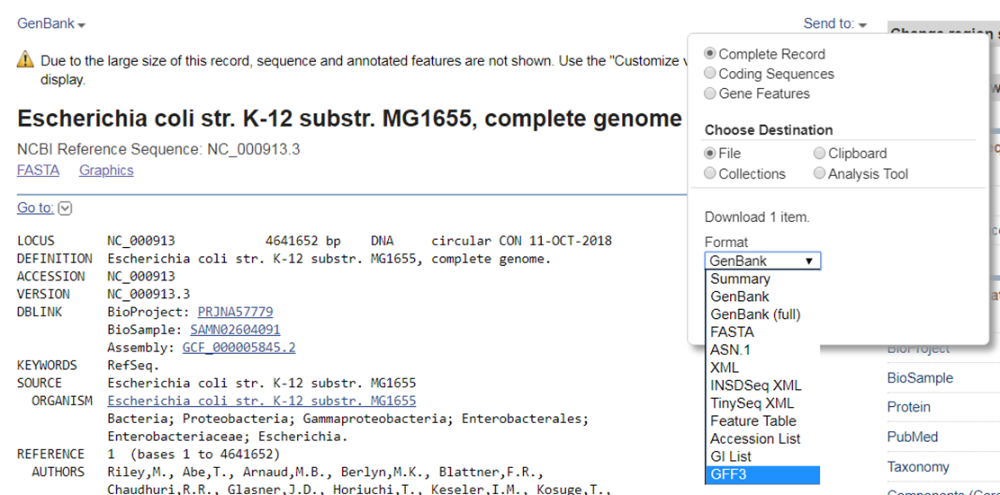
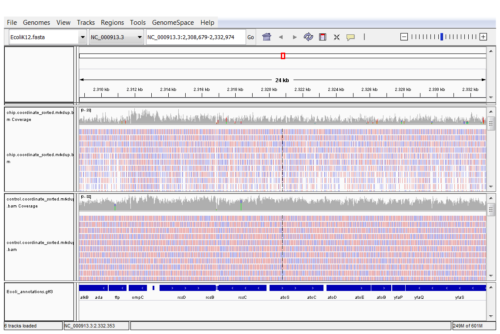
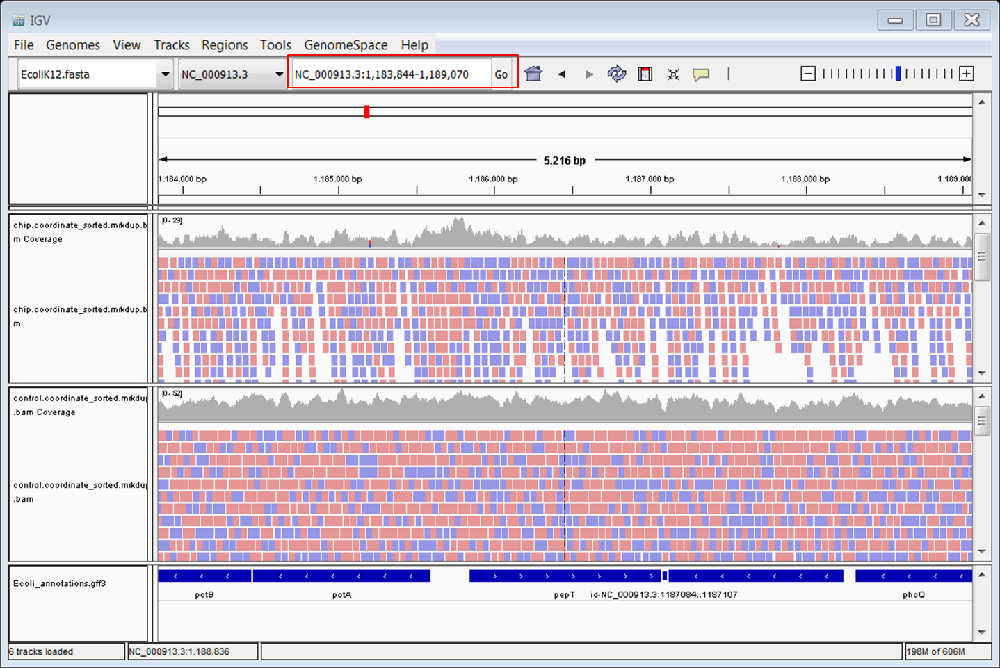
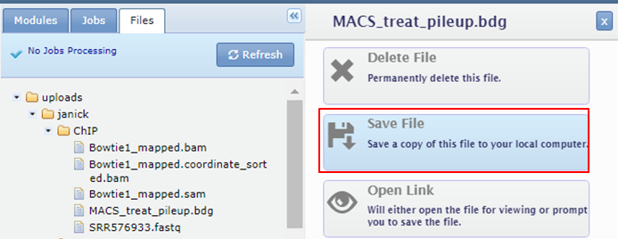
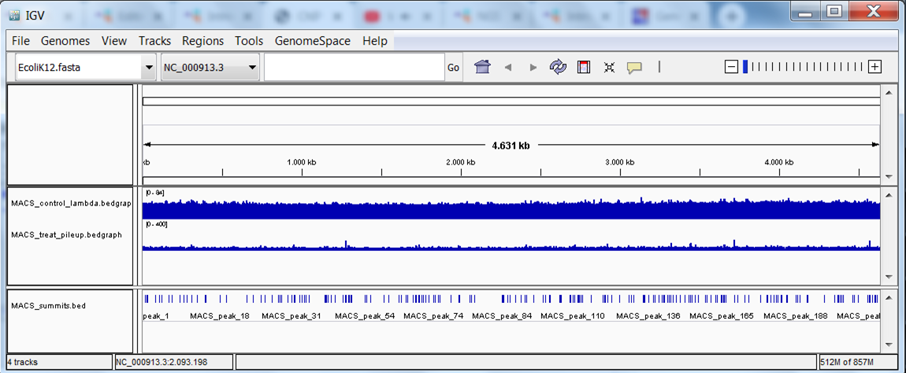

## Choosing a genome browser

There are several options for genome browsers, divided between the local browsers (need to install the program, eg. IGV) and the online web browsers (eg. UCSC genome browser, Ensembl). We often use both types, depending on the aim and the localisation of the data.
Note that if you're working on a non-model organism, the local viewer will be the only choice. If the aim is to share the results with your collaborators, view many tracks in the context of many existing annotations, then the online genome browsers are more suitable.

## Viewing the aligned reads in IGV

Open IGV. Be patient, it might take a few minutes for the program to start.
Change the genome in IGV from '''Human hg19''' to the one you used in the mapping.

> Load the desired genomed. 
> Load the *E. coli* genome as reference (from the file Escherichia_coli_K_12_MG1655.fasta, downloaded to build the bowtie index).

- Top menu: **Genome** -> **Load Genome from File**
 
- The loaded genome appears in the top left panel:
 

You can also visualize the annotation (genes) in IGV. You can obtain a file with annotations from the Refseq record.

> Download the annotations from RefSeq in GFF3 format. 
> Go to the [RefSeq record](https://www.ncbi.nlm.nih.gov/nuccore/NC_000913.3) of the *E. coli* genome.
> - Expand the **Send to** section at the top of the page.
> - Choose **File** as destination.
> - Select **GFF3** format.
 

You can also [download the GFF3 file](http://data.bits.vib.be/pub/trainingen/NGSIntro/Ecoli_annotations.gff3) from our website.

If you want to load the .gff3 file and visualize the annotation properly in IGV, it’s necessary to comment (or remove) the third line:
```
##sequence-region NC_000913.3 1 4641652
##species https://www.ncbi.nlm.nih.gov/Taxonomy/Browser/wwwtax.cgi?id=511145
## NC_000913.3	RefSeq	region	1	4641652	.	+	.	ID=NC_000913.3:1..4641652;Dbxref=taxon:511145;Is_circular=...
NC_000913.3	RefSeq	gene	190	255	.	+	.	ID=gene-b0001;Dbxref=ASAP:ABE-0000006,ECOCYC:EG11277...
```

You can visualize reads in IGV as long as they are sorted according to genomic location. Download the two sorted and indexed bam files (for SRR576933 and SRR576938) from GenePattern to your computer and load them in IGV.

> Load the annotation and the bam files of the ChIP and the control sample. 
> - Top menu: **File** -> **Load from File**:
>  
> - You should see the track now.
> - Do the same for the .bam files.
> Note that you have to download the .bai files too and store them in the same folder as the .bam files. You do not have to explicitly open the .bai files in IGV but they have to be in the same folder as the .bam files or IGV will throw an error.
> - Zoom in u8ntil you see the reads

 

**Browse around in the genome. Do you see peaks?**

> Go to the following gene: pepT.
> Type **pepT** in the box at the top (red) and click **Go**:
 

Do the same for gene ycfP.
Looking at .bam files does not allow to directly compare the two samples as data are not normalized. To generate normalized data for visualization you can use bamCoverage from deepTools (it's available in GenePattern). It generates BigWig files out of .bam files.

> Create a BigWig file from the sorted and indexed .bam file of the ChIP sample
> The bamCoverage tool has the following parameters:
> - **input file** is the sorted and indexed .bam file to process
> - **index** is the accompanying .bai file
> - **output format** is the output file type, we want to generate a **BigWig** file
> - **genomeSize** **4639675** nt for *E. coli*
> - **normalize**: different overall normalization methods; we will use the **RPGC** method corresponding to 1x average coverage
> - **skip noncovered**: skip non-covered regions (without mapped reads) in the genome? Set to **yes**.
> - **extend reads**: extend reads to fragment size, in our case **200** nt.
> - **ignore duplicates**: reads that map to the same location in the genome will be considered only once. Set this to **yes**.

Repeat for the control (again you see the benefit of creating a pipeline for repeating the same steps on multiple samples).
Download the BigWig files, start a new session in IGV and load the BigWig files in IGV.

> Create a BigWig file from the sorted and indexed .bam file of the ChIP sample
> - Top menu: **File** -> **New session**
> - Top menu: **File** -> **Load from File**. Load the two BigWigs and the .ggf3 with the annotation.
> - Right click the names of the BigWig tracks and select **Autoscale**.

**Go back to the genes we looked at earlier: pepT, ycfP. Look at the shape of the signal.**

## Viewing the peaks in IGV

Download the bdg files generated by MACS from GenePattern to your computer and rename them with the extension .bedgraph.

> Dowload the bdg files. 
> Click the names of the bdg files in the **Files** tab and select **Save File**
 

Replace .bdg by .bedgraph otherwise the file will not be recognized by IGV.
Open a **new session** in IGV. Reload the .ggf3 file with the annotation.

> View the bedgraph files. 
> Load the control bedgraph file:

- Top menu: **File** -> **Load from File**:
 
You might get a warning that the file is big. Simply click on the button continue.

- You should see the track (in blue):
 

Repeat this step to load the treatment bedgraph file. You should now see the 2 tracks (in blue):
 

Download and view the BED file containing the peak locations.

> View the bed file with the peak locations. 
> Save the file from GenePattern to your computer and load the bed file into IGV.
A new track with discrete positions appears at the bottom:
 

The end result should look like this: 3 tracks with data (the bedgraph files of the 2 samples and the peaks file) and 1 track with annotation:
  

**Go back again to the genes we looked at earlier: pepT, ycfP. Do you see peaks?**
