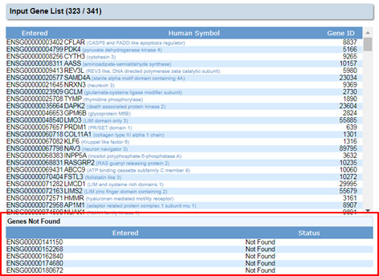
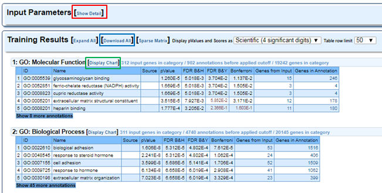
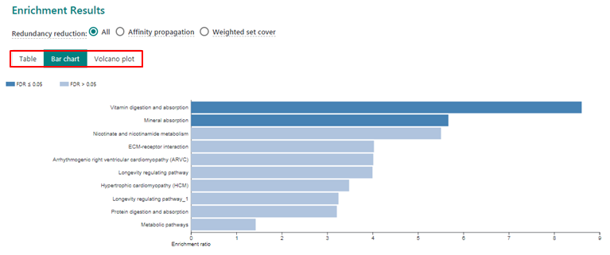
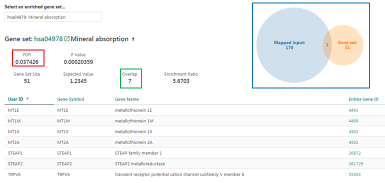

----
layout: tutorial_hands_on

title: "Functional enrichment analysis"

questions:
  - ""

objectives:
  - ""

time_estimation: "120m"

key_points:
  - ""

contributors:
  - janick-bits
---
## What’s the biology behind a list of genes ?

Omics experiments typically generate lists of hundreds of interesting genes: 
- up- or downregulated genes identified in an RNA-Seq experiment
- somatically mutated genes in a tumor identified by exome sequencing
- proteins that interact with a bait identified in a proteomics experiment
- ...

### Over-representation analysis

Since it's impossible to evaluate each gene individually, the most meaningful approach is to see what functional annotations the genes in the list have in common e.g. are many of them involved in the same pathway ?

Functional characterization of a gene list involves the following steps:
1. Add functional annotations to the genes in the list
2. Define a background: typically the full set of all genes in the genome
3. Perform a  statistical test to identify **enriched** functions, diseases, pathways…

Enriched means over-represented, occurring more frequently in the list than expected by chance based on the background data. 

It is recommended to **characterize up- and downregulated genes separately**.

!! Thousands of pathways are tested for enrichment, this could lead to false positives. **Multiple testing correction** is used to correct the p-values from the individual enrichment tests to reduce the chance of false positives !!

#### ToppGene: most up-to-date but only human, mouse and rat
[ToppGene](https://toppgene.cchmc.org/) is the most up-to-date portal for gene list functional enrichment. See [this overview](https://toppgene.cchmc.org/navigation/database.jsp) of their resources of functional annotations and their last update date. 

The **ToppFun** tool returns enriched terms from GO, phenotypes, pathways, protein interactions, domains, transcription factor binding sites, miRNA-target genes, disease associations, drug-gene interactions compiled from various data sources...

It supports gene symbols, Ensembl, Entrez, RefSeq and UniProt IDs from human. However, since gene symbols for human, mouse and rat are identical the tool can also be used for mouse and rat. 

> #####  Exercise ToppGene
>  How to do functional enrichment analysis with ToppFun ?
>    > #####  answer
>    > - On the [ToppGene](https://toppgene.cchmc.org/) page click the first link **[ToppFun](https://toppgene.cchmc.org/enrichment.jsp): Transcriptome, ontology, phenotype, proteome...**
>    > - Enter gene symbols or Ensembl IDs in the box **Training Gene Set**
>    > - Click **Submit Query**
>    > - If the gene list contains non-approved symbols or duplicates, they are listed under **Genes Not found**. 
>    > 
>    > 
>    > - In the section **Calculations** select the functional annotation types you want to test (all in our case) and select the multiple correction method (default FDR is ok) and the significance cut-off level (default 0.05 is ok)
>    > - Click **Start**
>    > - **Input Parameters** summarizes the input parameters of the search. Click the **Show Detail** (red) link to see them. 
>    > - **Training results** contains the enrichment analysis results. **Download all** (blue) will download the analysis results as a text file.
>    > - Click the **Display chart** (green) link to visualize the results
>    > 
>    > 
>    > - If you want to see which genes from your list belong to a certain annotation click the number in the **Genes from innput** column
>    > 
>    {: .solution}
{: .hands_on)

#### Enrichr: longest list of resources but not so up-to-date

[Enrichr](http://amp.pharm.mssm.edu/Enrichr/) use a respectable number of [resources](http://amp.pharm.mssm.edu/Enrichr/index.html#stats) to compute enrichment but they are not as regularly updated as those of ToppGene. To learn more about Enrich, see their [FAQ page](http://amp.pharm.mssm.edu/Enrichr/#help).

Enrichr uses a list of gene symbols as input (one per line). It only supports human, mouse and rat. You can upload the list by selecting a text file or by simply pasting the list of gene symbols into the text box. 

> #####  Exercise 1 Enrichr
>  How to perform functional enrichment analysis in Enrichr ?
>  
>  Browse to [Enrichr submission page](http://amp.pharm.mssm.edu/Enrichr/index.html) and click the **Submit** button
{: .hands_on)

The results page consists of multiple tabs, each tab giving an overview of a specific type of annotation (Transcription, Pathways, Ontologies...), e.g. 

> #####  Exercise 2 Enrichr
>  How to visualize the results for KEGG pathways as a bar chart ?
>    > #####  answer
>    > Go to the **Pathways** tab and expand the results for **KEGG** as a bar chart.
>    {: .solution)
{: .hands_on)

The bar charts are interactive: hover your mouse over the bars to see the enrichment scores. Clicking the bars will order the terms according to different scores.

The length of the bar represents the significance of that specific term. In addition, the brighter the color, the more significant that term is.

Enrichr implements three approaches to compute enrichment scores:
- The **p-value** comes from a test implemented in most enrichment analysis tools: the hypergeometric test
- The **q-score** is the adjusted p-value using the Benjamini-Hochberg method for correction for multiple hypotheses testing.
- EnrichR computes enrichment using the hypergeometric test for many random gene sets to compute mean and standard deviation of the expected rank for each annotation. Then it computes an **odds ratio** reflecting the deviation of the actual rank from this expected rank.
- They combine the p-value of the hypergeometric test with the odds ratio into a **combined score**
 
> #####  Exercise 3 Enrichr
> How to obtain the table containing the actual scores ?
> Sort the terms according to adjusted p-value
>    > #####  answer
>    > - If you want to see the actual scores click the **Table** tab
>    > - Click the name of the column you want to use for sorting
>    > 
>    {: .solution)
{: .hands_on)

> #####  Exercise 4 Enrichr
> Look at the results for GO Biological processes, OMIM disease, and TargetScan miRNAs
> 
{: .hands_on)

> #####  Exercise 5 Enrichr
>  How to visualize enriched Transfac and Jaspar TFBS as a network ?
>    > #####  answer
>    > - Go to the **Transcription** tab and click **TRANSFAC and JASPAR PWMs**
>    > - Visualize the results as a network by clicking then **Network** tab 
>    > 
>    {: .solution)
{: .hands_on)

Each node in the network represents a term (in this case a Transcription Factor) and a link between two nodes means that the 2 transcription factors have some genes from the list in common. the genes are linked to both transcription factors. Since these transcription factors share target genes from the list they might interact to regulate the process you're studying.

#### Webgestalt: all organisms but one resource at a time

This tool largely overlaps in data-sources with Enrichr but updates them more regularly.

[WebGestalt](http://www.webgestalt.org/) accepts many ID types and supports 12 different model organisms. For other organisms it allows to upload your own functional annotation database (see section 3.1 of the [manual](http://www.webgestalt.org/WebGestalt_2019_Manual.pdf) of this tool).

> #####  Exercise 1 WebGestalt
>  How to calculate enrichment of KEGG pathways in a list of genes ?
>    > #####  answer
>    > - In the **Organism** box select the correct organism
>    > - In the **Method** box select **Over-Representation Analysis**
>    > - In the **Functional Database** boxes select **pathway** and **KEGG**
>    > - In the **Gene ID type** box select the correct ID type
>    > - Upload the list of IDs
>    > - In the **Select Reference Set** box select the correct background, for lists generated by RNA-Seq experiments **genome, protein-coding** is a good choice because that is what you have measured
>    > - Click the **Submit** button
>    > 
>    {: .solution)
{: .hands_on)

The **Enrichment results** can be visualized as a table, a bar chart or a Volcano plot. Dark blue bars are considered significantly enriched. 

Clicking a bar shows the details on the bottom half of the page: 
- **FDR** is the corrected p-value (blue)
-**Mapped input** represents your gene list
- **gene set** is the total group of genes in the genome with this annotation
- **overlap** is the number of genes from your list with this annotation. They are listed in the table.

> #####  Exercise 2 WebGestalt
> Repeat the enrichment analysis on Wiki pathways
{: .hands_on)

Again, many more tables can be generated in WebGestalt and you should choose the type of enrichment that fits your experimental needs. Data can be saved back to disk for further use.

#### g:Profiler: many organisms but limited resources
[g:Profiler](https://biit.cs.ut.ee/gprofiler/) supports a [long list of organisms but has less resources](https://biit.cs.ut.ee/gprofiler/page/organism-list) than the other tools since it only retrieves functional annotations from Ensembl. It is very [regularly updated](https://biit.cs.ut.ee/gprofiler/page/news).

For Enrichment analysis you need to use the 

### Gene set enrichment analysis
Some omics experiments generate a ranked list of genes:
- genes ranked by differential expression score from a RNA-Seq experiment
- genes ranked by sensitivity in a genome-wide CRISPR screen
- ...

To analyze these lists, the following steps are taken
1. The genes are divided into groups based on functional annotation (gene sets)
2. For every group enrichment of high or low scores is calculated

Groups of related genes are called gene sets: a *pathway gene set* includes all genes in a pathway. 

This is why this type of analysis is called GSEA, Gene Set Enrichment Analysis. It assumes a whole-genome ranked list as input. 

It is most often done in R or via software that you install on your computer like  [GSEA](http://software.broadinstitute.org/gsea/). If you only have scores for a subset of the genome you should analyze the data using [g:Profiler](https://biit.cs.ut.ee/gprofiler/)with the **Ordered query** option.

### Resources of functional annotation
Functional annotations can be very diverse: molecular functions, pathways (genes that work together to carry out a biological process), interactions, gene regulation, involvement in disease... 

Online enrichment analysis tools often have functional annotation built-in for a limited set of organisms but some tools like WebGestallt also allow to upload your own annotation. 

[Pathguide](http://www.pathguide.org/) contains info about hundreds of pathway and molecular interaction related resources. It allows organism-based searches to find resources that contain functional info on the organism you work on. 

Gene sets based on GO, pathways,omics studies, sequence motifs, chromosomal position, oncogenic and immunological expression
signatures, and various computational analyses maintained by the GSEA team of [MSigDB](http://www.msigdb.org).
