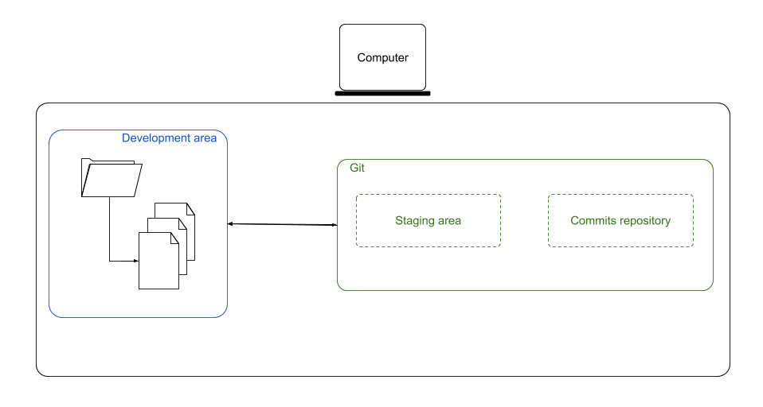

# 1. Introduction
Git is an open-source tool that manages your code, documents & other files by keeping track of each version of these files throughout its history. It is hence also termed a version controlling system. 

Why should you version control? 
- It keeps track of any changes to your files
- Synchronizes files between different people or infrastructures (i.e. laptops, servers, ...)
- Testing new code
- Reverting back changes

One of Git's advantages is that you can choose whenever you save a version of your code, making it very flexible and powerful, however also comes with the downside that it requires good practice from your side to frequently and consistently save your files. Git works on the command line of e.g. your computer, whereas GitHub is a service for connecting and uploading/downloading files much like saving files in the cloud. Alternatives for GitHub are Gitlab, Bitbucket, etc. 

# 2. Installations 
For this course we will explore version controlling in a mixture of [GitHub online](https://github.com/) & [Git](https://git-scm.com/) on the command line. The latter requires some basic understanding of the Linux command line. If you're not familiar with Linux command line, you can have a look at the materials [here]((https://material.bits.vib.be/topics/linux/)). After discussing Git's essential features, we'll introduce how you can make life easier with Git(Hub)'s integration in Rstudio. 

- Git can be installed for any OS (Windows, Mac or Linux) from [this link](https://git-scm.com/downloads).  
- Make an account on [GitHub](https://github.com/). 
- GitHub Desktop can be installed from [this link](https://desktop.github.com/). 

We will address further configurations in the next chapter. 

# 3. Three conceptual areas
Before diving in, let's have a look at how Git works. It's important to understand the three conceptual areas that exist locally when using Git on your computer: the development area, the staging area and the repository containing the commits. 

1. The **development area** is where your coding happens. Usually this is a folder with multiple files on your computer. Git will never change anything at this level, actually it won't really do anything. The only thing Git does is remembering that it needs to keep track of changes made in this folder or its files. Initializing Git on a project is only done once in the beginning. 
2. The **staging area** is an intermediate stage which assembles the files with changes you want to save. Imagine that we want to save a file, we first have to add it to the staging area before we can commit it.  
3. Files that are in the staging area are then committed to what we'll call the **commit repository** here. Committing is a synonym for saving the files in the Git terminology. The repository with commits contains a list of all the commits that we have done in a project. It's neatly structured in a history log which we can call at any point. Notice that all of this is still happening on our computer. 

Here's an example. Let's assume that we're starting a new project. Usually that  also means that you make a new folder on your computer where you will keep all the files related to the project. The first thing you have to do is to tell Git (or GitHub Desktop) that it has to keep track of this folder.In this step, we're initializing Git on this folder. Now, you just made your first file, however it's not automatically saved in Git. First, you'll have to add it to the staging area and afterwards you need to commit it to the repository. Voila, it's now safely stored in Git's repo.  
If we make a second file, the only thing we have to do now is to add it to the staging area and afterwards commit it. 

Notice that the repository is not yet visible on [github.com](https://github.com/). For this we would still need a fourth and last step, namely pushing the commits repository from your local machine to GitHub. By pushing your commits repository, you'll not only push the commits repository GitHub, but also push the files within the project to GitHub. After this last step, your project and all of the files are accessible in a GitHub repository.

During our adventure through git & GitHub we'll use some specific glossary. Confused on what the meaning of all these new words are? Check out the [GitHub glossary!](https://help.github.com/en/github/getting-started-with-github/github-glossary)