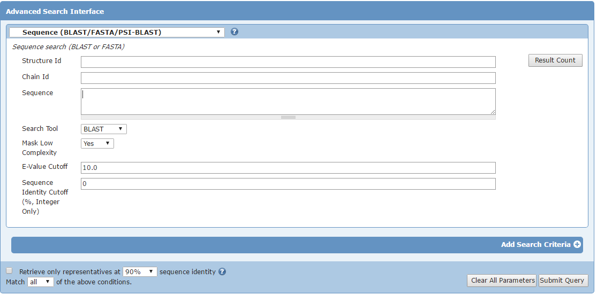
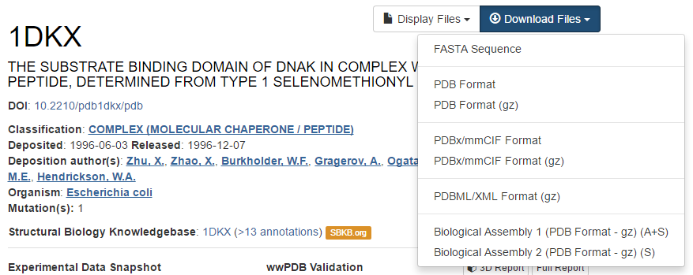

> ### Agenda
>
> In this tutorial, we will deal with:
>
> 1. TOC
> {:toc}
>
{: .agenda}

# Search for a structure
## Via [UniProt](http://www.uniprot.org/)
The way of searching for a specific protein structure depends on the
data you already have. You might already have the PDB ID (a unique
identifier), that's an easy one. But mostly you have the protein name or
you just have a sequence. In the last cases I recommend to start from
the UniProt website at <http://www.uniprot.org>, which is the best
annotated protein database in the world. Our first model protein will be
the molecular chaperone DnaK from *E. coli*.
Below is an image of the UniProt search box where you can start your
search for proteins.


> ###  Explore a PDB structure on the Uniprot web site 
>
> 1. Go to the UniProt website and search for the DnaK protein 
> - The UniProt search engine returns a list of DnaK protein sequences from a variety of organisms. An entry with accession code **P0A6Y8** and entry name **DNAK_ECOLI** should be near the top of this list.
> 2. Click on the *accession code* (column Entry) to view the protein page of this DnaK from the model organism *Escherichia coli*.
> 3. Click on *Structure* in the left-side menu and then look at the *3D structure databases* table. 
{: .hands_on }

> ###  Guidelines which PDB structures to select 
>
> Which structures (give the 4-character PDB ID) of the C-terminal domain of DnaK should preferentially be use for analysis and why?
> > ###  Solution
> > Usually, the recommended selection criteria are using an X-ray structure with low resolution and low Rfree factor. Furthermore, the PDB database has pre-calculated a validation report for all of the structures.
> > As an example, have a look at https://www.ebi.ac.uk/pdbe/entry/pdb/4EZX under the section 'Experiments and Validation'. For many PDB structures, there is also a re-done structure available with a vast amount of informaton on the quality of the X-ray structure and suggested 'better' models e.g. (https://pdb-redo.eu/db/4ezx). In our case, we could opt for the structures 1DKX and 4EZX.
> >
> > This is a difficult example since there are so many high resolution structures available. So, it is recommended to study the articles and compare the available structures to find your favorite structure for further analysis. 
> >
> {: .solution}
{: .question }

## Via the Protein Data Bank by PDB ID

You can find structural information directly at the PDB database. The
web site of the PDB consortium is located at <http://www.wwpdb.org>.
This web site provides links to all members of the PDB (left side). It
is a question of taste which resource you start off with. For X-ray
structures, it is currently PDBe, RCSB PDB, PDBj. For NMR structres, you
find the BMRB. In today's course, we focus on the PDB resources only.

Below is an image of the RCSB search box
<http://www.rcsb.org/pdb/home/home.do> where you can start your search
for structures.


The PDB file with ID **1DKX** contains the atomic coordinates of the
molecular chaperone (DnaK) from *E. coli*.

> ###  Search a structure on the RCSB web site
>
> 1. Go to the PDB website and type 1DKX in the search box 
{: .hands_on }

This will lead you to the same page we got earlier through UniProt.

## Via the Protein Data Bank by sequence

In lots of cases we only have a sequence of which we would like to find
out if there is structural information. The PDB can be searched using a
sequence as input. Here is the sequence of the C-terminal substrate
binding domain of DnaK:
```
    DVKDVLLLDVTPLSLGIETMGGVMTTLIAKNTTIPTKHSQVFSTAEDNQSAVTIHVLQGE
    RKRAADNKSLGQFNLDGINPAPRGMPQIEVTFDIDADGILHVSAKDKNSGKEQKITIKAS
    SGLNEDEIQKMVRDAEANAEADRKFEELVQTRNQGDHLLHSTRKQVEEAGDKLPADDKTA
    IESALTALETALKGEDKAAIEAKMQELAQVSQKLMEIAQQQHAQQQTAGADASANNAKDD
    DVVDAEFEEVKDKK
```
The PDB allows sequence searches through the same search box we used
before.


There is also an Advanced Search section, with a Blast/Fasta option in
the Sequence Features section.



> ###  Hands-on: BLAST search for PDB structure 
>
> 1. Go to the Advanced Search section 
> 2. Please select 'Sequence BLAST/PSI-BLAST' in the Query type drop down.
>    This method allows you to change some parameters for the search. 
> 3. Copy and paste the sequence in the ''Sequence'' field 
> 4. Press ''Submit query''.
> 5. You should see the same structures popping up as you saw in the UniProt page of DnaK. 
{: .hands_on}

# The PDB file

## Introduction

A PDB (Protein Data Bank) file is a plain text file that contains the
atom coordinates of a solved 3D structure of a protein or even DNA. Such
coordinate files can be obtained at the Protein Data Bank at
<http://www.rcsb.org/pdb>. Each PDB file has a unique identifier (ID)
consisting of 4 characters, the first one is always a number. Note: It
has been announced that the 4 character code will change in the future
<https://www.wwpdb.org/news/news?year=2017\#5910c8d8d3b1d333029d4ea8>.

The PDB file with ID **1DKX** contains the atomic coordinates of the
molecular chaperone (DnaK) from *E coli*.

> ###  Hands-on: BLAST search for PDB structure 
>
> 1. Go to the PDB website at <http://www.rcsb.org/pdb>
> 2. Type 1DKX in the search and try to answer the following questions. 
{: .hands_on}

> ###  Questions
>
> 1. How many molecules were solved in this PDB file? What kind of molecules are these (proteins, peptides, DNA, ...)? 
> 2. Does the structure represent the full protein? If not, how many residues are missing? Hint: Click on the UniProt KB link in the Sequence tab to see the full sequence. 
> 3. Was this structure solved by X-Ray or NMR? 
> 4. What is the atomic resolution and R-factor?
>
> > ###  Solution
> > 1. Two, called polymers or chains: they are polypeptides  
> > 2. To answer this question you can go to the sequence tab at the top:
> >    - 
> >    - Summary: a large chunk of the N-terminus is missing from the structure, the C-terminus is virtually complete.
> > 3. X-RAY diffraction, as shown by Experimental Details 
> > 4. Atomic resolution: 2.00 Ångstrom and R-factor of 0.206 
> {: .solution }
{: .question}


## Downloading the structure 

The file that holds the 3D coordinates can be downloaded by clicking on 
*Download files* in the top right corner and then choosing *PDB file (text)*. 
For convenience, save this file on your desktop. The filename is the 
4-character unique PDB ID.



> ###  Hands-on: Open downloaded PDB file in an editor 
> 1.   Open this file with a text editor, e.g. WordPad is an excellent tool for that.
> 2. Do you see the different sections in the PDB file? Analyse some ATOM lines and try to explain what kind of data is in each column.
{: .hands_on}

Additional exercises on searching PDB can be found on [the basic bioinformatics exercises page](http://wiki.bits.vib.be/index.php/Exercises_on_Protein_Structure).

