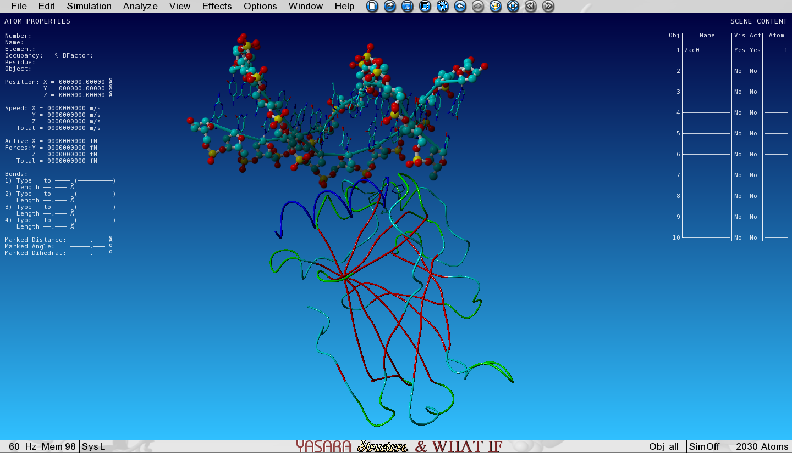
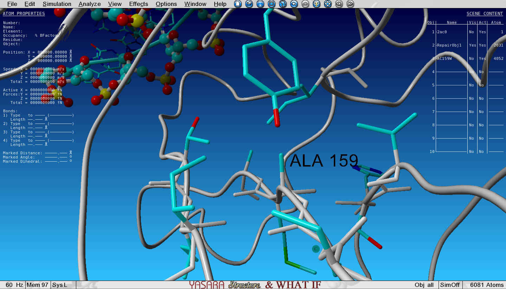
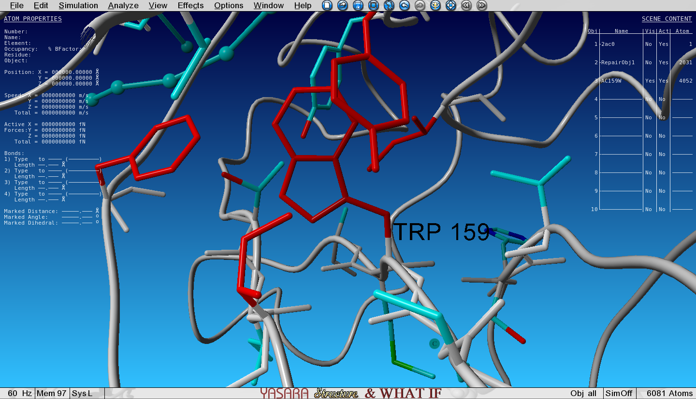
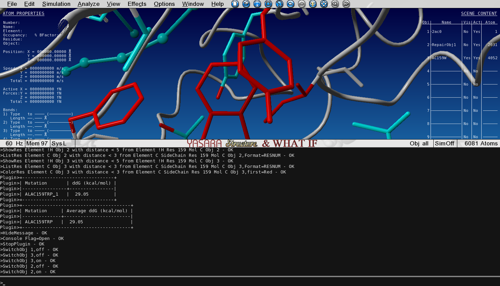
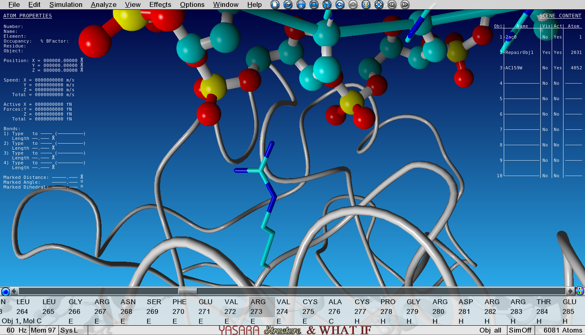
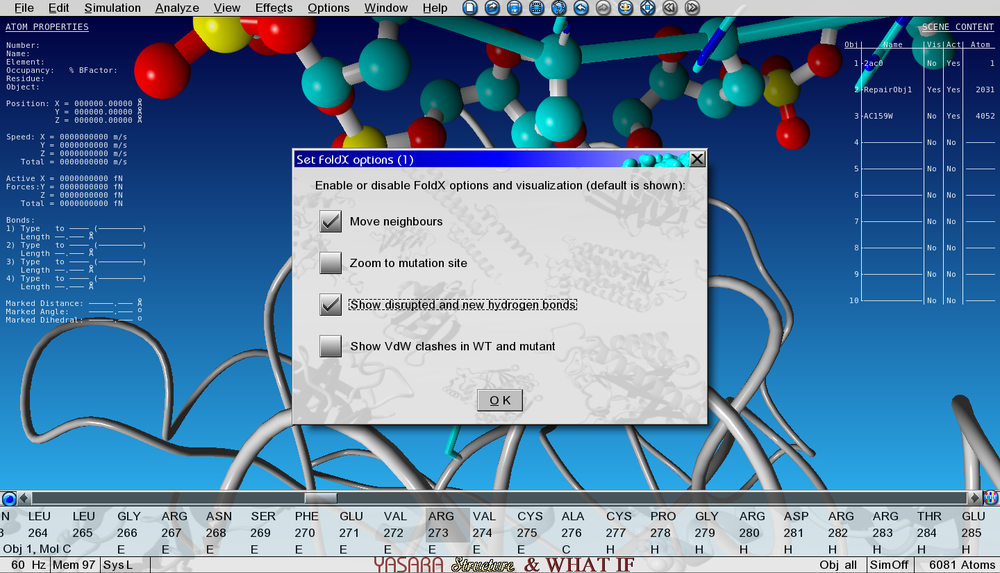
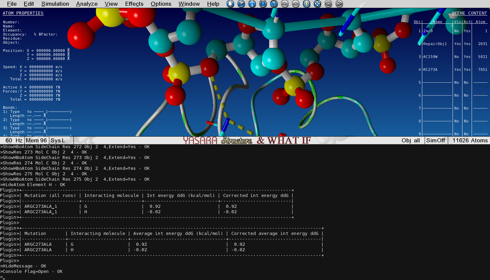

# Introduction
{:.no_toc}

<!-- This is a comment. -->

Mutations in proteins can have various origins. Natural occurring mutations are random and can have any kind of effect on the protein structure and/or function. Mutations can have no effect at all, be stabilizing of destabilizing. In the last two cases, these can lead to diseases.

But we can also make mutations in the wet lab to study the effect of a single residue position on protein stability, interaction with a peptide ligand etc ... Such site-directed mutagenesis in the wet lab is hard labour and costs money, I don't have to explain that to you. So wouldn't it be easier, cheaper and more rational if you could predict the effect of some mutations first with bioinformatics and then test the really interesting ones in the lab?

FoldX is a molecular modeling tool that can quantitatively predict the change in free energy (kcal/mol) upon mutation. These values approach experimental determined values. FoldX is a non-interactive command line program. In other words, not user friendly. But the bright news is that I recently developed a YASARA plugin for FoldX, so that all predictions are just a few clicks away. And the nice thing is, it's all free!

>
> In this tutorial, we will cover:
>
> 1. TOC
> {:toc}
>
{: .agenda}

# P53 as example protein 

In this section we will let the FoldX plugin loose on some real world examples and give you step-by-step instructions on how to proceed and analyze the results. We will use the P53 tumor suppressor protein as our example molecule. In a first exercise you will make a point mutation with FoldX and determine if the mutation is stabilizing or destabilizing for the P53 structure. In a second exercise you will design a mutation in the P53 structure at the DNA binding interface and determine how the mutation affects the interaction energy of P53 with the DNA strand.

## Get data

> ###  Hands-on: Data upload
>
> Download the file [2AC0.sce](https://zenodo.org/record/3551686/files/2AC0.sce?download=1).
>
{: .hands_on}

# What do FoldX energies mean?


Before we start, some basic information about FoldX energies is necessary.

First of all, FoldX energies are expressed in kcal/mol.

The main focus of FoldX is the prediction of free energy changes, e.g. what happens to the free energy of the protein when we mutate an Asp to a Tyr? FoldX will then calculate the free energy of the wild type (WT) and the mutant (MT) and make the difference:

```
ddG(change) = dG(MT) - dG(WT)
```

FoldX is trained to make ddG(change) approach experimental values. It is important to realize that dG(WT) and dG(MT) are meaningless numbers as such. These do not correlate with experimental values. Only ddG(change) does.

As a rule of thumb we use:

```
ddG(change) > 0 : the mutation is destabilizing

ddG(change) < 0 : the mutation is stabilizing
```

The error margin of FoldX is approximately 0.5 kcal/mol, so changes in that range are insignificant. 

# How to minimize the structure with FoldX

FoldX assumes that the starting structure has been energy minimized. Although crystal structures with high resolution represent the form with a low energy, FoldX performs best when we minimize it just before we do the predictions. This FoldX procedure is called RepairPDB and should be done on each structure you want to perform calculations on.

Open the YASARA scene 2AC0.sce in YASARA. This is a part of a tetrameric complex of the transcription factor P53 bound to DNA. I removed 3 of the 4 P53 structures for simplicity and visualized some nice features.

Load the scene with:

```
File > Load > YASARA Scene
```



To Repair (or minimize) the structure with FoldX go to:
```
Analyse > FoldX > Repair object 
```


And select the only object in the list.

When the Repair is finished, the Repaired Object is placed in Object 2 (see top right corner) and superposed with the original Object 1. Take a look at the sidechains and see what FoldX has done while Repairing.

If you feel the repair takes too long (more than 10 minutes) due to a slow computer, download and open this YASARA Scene with the [Repaired Object](https://zenodo.org/record/3551686/files/2AC0_Repaired.sce?download=1).

Because we will continue working with this Repaired Object, we can now hide the entire Object 1 by toggling the Visibility column in the top right corner head-up display (HUD).

# How to analyze a mutation 

FoldX has mutated the Ala to Trp and the structure with the Trp mutation has been loaded in the next Object (3) and is superposed with the wild type (WT, Object 2). We selected an option to show the VdW clashes in WT and mutant. The atoms that give rise to steric clashes are colored in red. Toggle the Visibility of Object 2 (WT) and Object 3 (mutant) and see how many clashes we introduced by mutating the Ala to Trp.







> ###  Questions
>
> Van der Waals clashes are red colored atoms. 
> Do you see a difference around the mutation site between WT and mutant? 
>
> > ###  Solution
> >
> > Toggle the Visibility of WT and mutant to see the differences. 
> > Open the Console by pressing the spacebar twice and see the free energy change of the mutation. 
> > Anything above a change of +0.5kcal/mol is already assumed to be destabilizing.
> > In the console - to open press spacebar twice - we see an energy change of +29 kcal/mol.
> > This is clearly a destabilizing mutation.
> >
> {: .solution}
>
{: .question}



# Study the effect of a second mutation 

Hide Object 3 by toggling its Visibility so that only Object 2 (the repaired WT) is visible.
First turn on all atoms in the molecules G and H (DNA) again as you did previously, because the FoldX run has hidden it (it rearranged the view to show the VdW clashes).

Show the sidechain of Arg273 of Object 2 by searching for it in the sequence selector, then right-click on it and go to:


```
Show atoms > Sidechain and CA and zoom in on Arg273
```

Notice how the positively charged Arginine is making an electrostatic interaction with the negative phosphate from the DNA backbone.



Let's see what would happen to the interaction energy between the DNA and P53 when we mutate this Arginine to Alanine.

Right-click on this Arg273 in the sequence selector and go to:

```
FoldX > Mutate residue
```

A number of menus is now presented and here is what you need to do in each menu:

1. Select Calculate interaction energy change
2. Select Ala
3. 'Move neighbours' and 'Show disrupted and new hydrogen bonds'
4. Don't change any numerical options in the last menu



> ###  Questions
> 
> 1. What is the change in interaction energy is between P53 and DNA chain G upon mutation?
>    And what is the reason?
> 2. Why doesn't the mutation affect the interaction with DNA chain H?
>
>
> > ###  Solution
> >
> > 1. Toggle the Visibility between this mutant and the WT structure and see how the hydrogen bonding changes and check the output in the Console. 
> >    
> >    We see that the mutation decreases the interaction with DNA strand G by approximately 1 kcal/mol
> >    since we lost 1 hydrogen bond.
> >
> > 2. ***TODO***  
> >
> {: .solution}
>
{: .question}

# Conclusion
{:.no_toc}

Instead of DNA-protein, FoldX can of course also calculate interaction energy changes in protein-protein or peptide-protein complexes.

