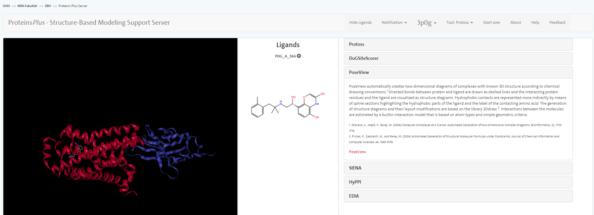
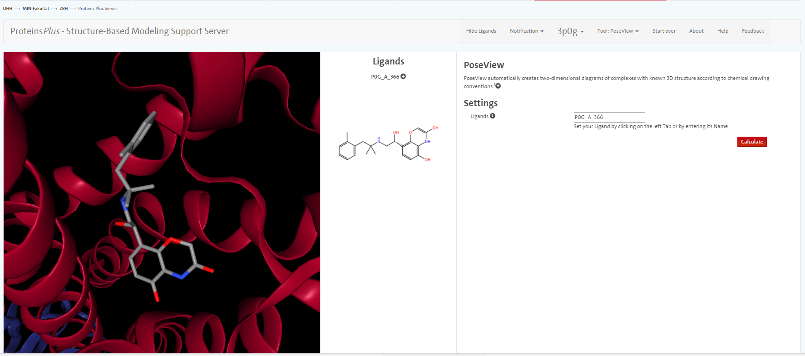
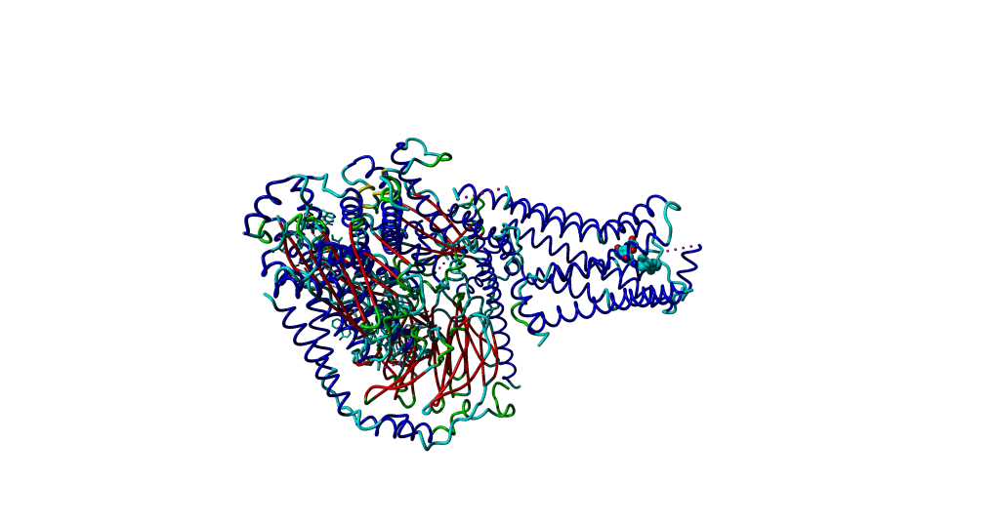

# Introduction
{:.no_toc}

<!-- This is a comment. -->

The goal of this exercise is appreciate how protein interactions can be studied through visual inspection and other software tools. Protein interactions can be classified into different groups regarding the molecular properties and functions of the interacting partners. (These groups are intertwined in several cases.) Some examples include:

- the interactions of proteins with other proteins, small molecules, carbohydrates, lipids or nucleic acids;
- Receptor-ligand interactions;
- Antigen-antibody interactions;
- Enzymatic interactions, enzyme-inhibitor interactions.

> ### Agenda
>
> In this tutorial, we will cover:
>
> 1. TOC
> {:toc}
>
{: .agenda}

# Exploring the structure of a nanobody-stabilized active state of the β2 adrenoceptor - the ligand 

We will start with exploring one crystal structure of the β2 adrenoceptor. Together with the Steyaert lab from VIB, Kobilka published several crystal structures of the β2 adrenoceptor in its various activation states (Rasmussen et al. Nature 2011, 477)


> ###  Get the structure
>
> 1. Download the crystal structure 3P0G from the PDB into YASARA. 
>
>    ```
>    File - Load - PDB file from internet    
>    ```
>    As you can immediately appreciate, it is a bigger crystal structure with more than one molecule. 
>
{: .hands_on}

> ###  Questions
>
> 1. How many molecules are present in the crystallized structures? 
> 2. And how many chain identifiers are used? 
>
> > ###  Solution
> >
> > 1. Answer for question1
> > 2. Answer for question2
> >
> {: .solution}
>
{: .question}

Some software routines need seperate chain identifiers for molecular entities to work correctly, so we suggest to rename the small molecule to chain L.


> ###   
>
> 1. Activate the Head-up display
> 2. Select Rename
> 3. Enter 'L' to proceed with the renaming. 
>
{: .hands_on}

We first have a look whether we can find out if there are specific interactions of the small molecule ligand with the adrenoreceptor.

In order to do so, we first have to add Hydrogens to all present molecules.

> ###   
>
> 1. Edit - Add - hydrogens to : All 
> 2. Change the display of the ligand to Sticks
> 3. Select the amino acids of the binding pocket i.e. a sphere of 10 Angstrom around the ligand
>    ```
>    Select – in sphere around – Residue and drag with the mouse until the display says 10 Å
>    ``` 
> 4. ```
>    View – show interactions – hydrogen bonds of - Residues
>    ```
>    select 'Selected' in the panel Belongs to or has
>    and press OK in the subsequent window
>
{: .hands_on}


> ###  Questions
>
> Between which amino acids and the ligand do you see hydrogen bonds?
>
> > ###  Solution
> >
> > 1. Answer for question1
> >
> {: .solution}
>
{: .question}


Given that hydrogen bonding is dependent on the definition of a hydrogen bond in the program, it is not a bad idea to use other tools to compare the analysis. There are many options to do this online if you look at published crystal structures. Next to the tools which are directly linked out from the web site of the crystal structure at the PDB database you can use the [ProteinPlus server](http://proteinsplus.zbh.uni-hamburg.de/)

Go to the web site of ProteinPlus and enter the PDB code 3P0G into the search box. After clicking on Go, you should be presented with on overview of tools the ProteinPlus server provides.

We do not go into great detail on all the tools but only mention PoseView. With this tool, you can prepare an automatic sketch of the small molecule-protein interactions.





> ###  Questions
>
> Between which amino acids and the ligand do you see hydrogen bonds? 
>
> > ###  Solution
> >
> > 1. According to PoseView, between which amino acids and the ligand do you see hydrogen bonds?
> > 2. What other interactions are presented in the sketch? 
> > 3. Inspect the visualisation in Yasara: Do you see the interactions in Yasara as well? 
> >
> {: .solution}
>
{: .question}


# Exploring the structure of a nanobody-stabilized active state of the β2 adrenoceptor - the nanobody 

In order to estimate the binding energy between the nanobody and the β2 adrenoceptor, we can use the FoldX tool AnalyseComplex. It is recommended to calculate these binding energies on energy-minimized structures. To illustrate the effect of the energy minimization, we compare the interaction energy of the current crystal structure and its minimized structure.


## Use the tool FoldX tool AnalyseComplex 

> ###  
>
> 1. Given that energy-minimization takes a while for this rather large complex,
>     please download the Yasara scene [here](http://data.bits.vib.be/pub/trainingen/PSA/3P0G_1.sce)  
>    
>    Calculate the interaction energies between the chain A and B of the object 3P0G 
>    and the RepairObj1, respectively. 
>
>    ```
>    Analyze - FoldX - Interaction energy of molecules
>    ```
{: .hands_on}

> ###  Questions
>
> 1. What is the dG in the two cases? 
> 2. Any idea why the difference is rather hugh?
>
> > ###  Solution
> >
> > 1. Answer for question1
> > 2. Answer for question2
> >
> {: .solution}
>
{: .question}

This command also creates a list of residues forming the interface of the two proteins. Hit space to see the list of residues in the interface.

Tip: This list can also be useful if you want to make visualisations of the interaction site.


# Comparing the active and the inactive conformation of the β2 adrenoceptor 

In case, there is still time, I would recommend to try to use some of your capabilities you learned today and create a superposition of the inactive and active conformation of the β2 adrenoceptor. We take one of crystal structures which are available: 3SN6

**TODO: add remark that we use the first chain A from 3P0G as target**

```
File - Load - PDB file from Internet
```

You will be kind of overwhelmed once the structure is loaded into Yasara. In order to get a first quick overview, click on the 'Center' buttom in the menu of Yasara (5th buttom from the left). Then, it is time to look at the PDB entry of 3SN6 in the PDB database to have a first idea on what molecules are in the PDB file.

As you see on the website [3SN6](http://www.rcsb.org/pdb/explore/explore.do?structureId=3SN6i), the chain R consists of 2 molecules, the β2 adrenoceptor and lysozyme. 
In the corresponding article, it is stated that 'the unstructured amino terminus of the β2AR is replaced with T4 lysozyme (T4L)'.

Since this is an extra molecule in the crystal structure which disturbes our view, we will delete it.

After the manipulation, the overall picture should look roughly like this.



In the following step, we superimpose only the receptors. The rest of the structures will move along.

```
Analyze - Align - Pairwise, based on structure - Molecules with MUSTANG

First, select the first chain R from 3SN6 and second, the first chain A from 3P0G as target

```


# Conclusion
{:.no_toc}

Sum up the tutorial and the key takeaways here. We encourage adding an overview image of the
pipeline used.
