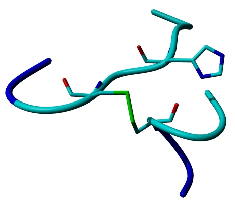
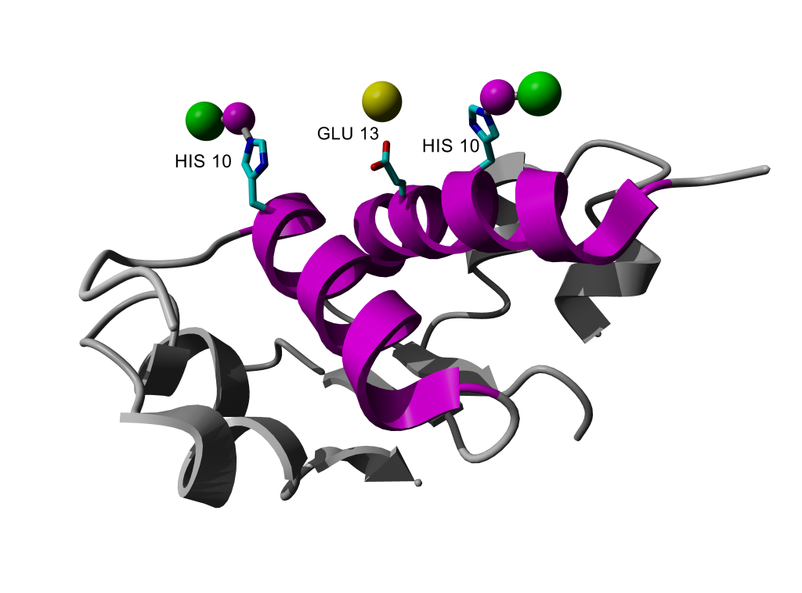
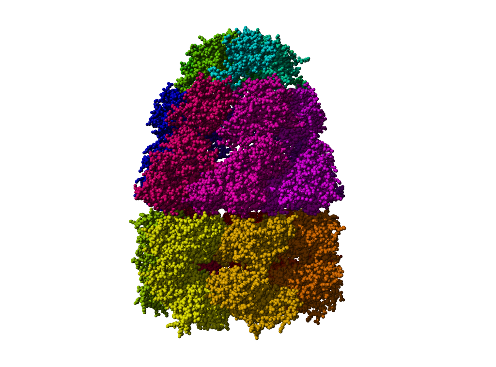

## Install Python and PovRay

Python and PovRay should be installed already, so you can skip this part.

The programming language Python must be installed to use some very useful YASARA features. Simply start YASARA as administrator. Right click the YASARA icon on the desktop and choose "Run as administrator". Once the program is opened, click

```
Help > Install program > Python
```

PovRay is used to make high quality publication-ready images and should be downloaded first with:

```
Help > Install program > PovRay
```

## Tutorial movie

Play the movie "Working with YASARA":

```
Help > Play help movie > General: Working with YASARA

```

## Scene styles

Open the PDB with code 1TRZ in YASARA.
```
File > Load > PDB file from Internet
```
If this option is not there, it means you haven't installed Python yet. Please check above.

The molecule will be loaded and presented in the ball style. Different scene styles exist to rapidly change the view:

* F1: Ball
* F2: Ball & Stick
* F3: Stick
* F4: C-alpha
* F5: Tube
* F6: Ribbon
* F7: Cartoon
* F8: Toggle sidechains on/off (press multiple times and see what happens)

**Be careful!** If you have just made a nice close-up of e.g. an active site where you show some residues and hide others, and put some atoms in balls while others are in sticks, you will lose everything when you press one of the F-keys!!! The F-keys change the viewing style without asking.

Try all the different scene styles!

## Showing and hiding residues

The function keys F1-F3 show all atoms and residues by default. The keys F4-F7 do not explicitly show atoms and residues but are merely a impressionistic representation of the structure. The F8 keys does, to a certain extent, show atoms, but only of side chains, not main chain atoms.
Mostly to do structure analysis, we want to show only the most interesting residues, the ones we want to analyze, and hide all the others.

The structure of insulin was crystallized together with some water molecules. In many cases, it is no problem to permanently delete those waters. To visualize the waters, select an atom view such as F1, F2 or F3. See the red water (oxygen) atoms floating around the surface?
```
Edit > Delete > Waters
```

Then select the base scene style without any explicit atoms, e.g. tube style (F5). Press F5. This is our representation of the backbone.

There are several ways to show the residues of interest:

1. From the menu
```
   View > Show atoms in > Residue
```
   Select Cys7 from Molecule **A** and press OK
2. From the sequence selector 
   Hover the mouse on the bottom of the screen, you will see the sequence selector opening. Open it permanently by pressing the blue nailpin on the left side of it. Search for Cys7 from Molecule **B**, right-click and select:  
```
   Show > Residue
```

Now show the atoms of His5 in Molecule B using a method of choice.

And now that we're on it, what is special about the two cysteines we just visualized?

**Hiding** individual atoms or residues works in the same way as showing them, only now you should go to **Hide atoms** in the menus.

## Showing and hiding secondary structure

Most published molecular images show a detailed active site and all the
rest is hidden for clarity. From the previous exercise we show the atoms
of 3 residues (let's assume this is our active site). Now secondary
structure of the rest of the molecule is also still visible. To hide all
that, we do not have to hide atoms, but hide the secondary structure
(the F5 tube view) from the rest of the structure. Atoms and residues in
YASARA are not the same as the term 'secondary structure'. Atoms and
residues are balls and sticks, 'secondary structure' is an artistic
impression of the structure (beta sheet arrows, helix ribbons, ...). If
you get this concept, you are a YASARA master.

So let's hide many of the secondary structure, but keep just a few
stretches around our active site. Our active site is Cys7 (A), Cys7 (B)
and His 5 (B). This can be done in several ways. Since we would have to
hide almost everything, I propose to hide first everything and then show
again those stretches that we want. But if you have a better idea, I
would like to hear it.

Hide all secondary structure:
```
   View > Hide secondary structure of > All
```

Then show stretches of residues 2-10 in Mol B and residues 4-10 in Mol A
in tube view as:
```
    View > Show secondary structure > Tube through > Residue
```
Then select the correct stretches of residues by keeping the CTRL key
pressed to select multiple residues.

There are still some metal-bound histidines flying around that weren't
hidden because they are metal bound (a YASARA specific thing). Hide
those histidines by clicking on one of the sidechain atoms, then
right-click and select:

```
   Hide atoms > Residue
```

The nasty dative bonds and metals can be removed simply by deleting all
of them:

```
   Edit > Delete > Residue > Name
```

In the name column select all the metals and ions you can find.

Et voilà, a publication ready image!



## Labels

You can put labels on the residues you want to highlight by going to the
main menu or selecting an atom from a residue and right-click. In the
latter case you select:

```
   Label > Residue
```

Note that *residue name* and *residue number* is automatically selected.
Change the height to 0.5 or so and select a nice color for the label.
Presto\!

## Colors

You can color on all levels: atoms, residues, molecules and objects. So
be careful, if you color a residue, all of its atoms will get that
color. If you color a molecule, all atoms in that molecule will get that
color.

Let's color the secondary structure (the backbone in our case) of our
active site in orange. But the sidechains should keep their Element
colors. So we shouldn't color entire residues, but only a selected atom
set. Therefore our selection will be at the atom level, not the residue
level. Go to:

```
    View > Color > Atom > Belongs to or has > Backbone
```

Then select the orange color (color code 150) and select 'Apply unique
color'. Hopefully, it is a satisfying result.

## Saving all the beautiful work

It would be a pitty that you spent hours creating fancy molecular
graphics for that next Nature paper while you can't continue on the work
the next day. That's why YASARA can save the entire Scene including
orientations, colors, views, everything. To save the current scene, go
to:

```
    File > Save as > YASARA Scene
```

Choose a filename such as MyInsulin.sce

To load the work again in YASARA go to:

```
    File > Load > YASARA Scene
```
    
Careful: loading a Scene will erase everything else!

## Creating high quality images

To save the current view to a high quality publication ready image file,
go to:

```
File > Save as > Ray-traced hires screenshot
```

This requires that the PovRay program has been installed. See the first
item on this page.

Usually, you prefer to have a transparent background, so check the
respective box.

## Distances

**Distances** between atoms are calculated as follows:

  - select the first atom
  - keep CTRL pressed and select the second atom.
  - left of the screen indicates the 'Marked Distance' in Angstrom.

<!-- end list -->

###  Questions

What is the distance between the C-alpha (CA) atoms of Tyr19 and Leu16?

> <details markdown="1">
> <summary> Solution
> </summary>
> To solve the question you need to select a view that shows you atoms
including C-alphas. Possible views or scene styles that show these atoms
can be F1 (ball), F2 (stick), F3 (ball\&stick) and F4 (C-alpha). The
views F5-F8 won't show you any CA's explicitly. Try it.
> So you've probably noticed that pressing the CTRL button allows you to select multiple atoms. This is important for the next exercise.
> The distance is 5.8 Ångstrom.
> </details>
{: .question}

## Hydrogen bonds

To show hydrogen bonds, YASARA needs the actual hydrogens to be present.
In NMR structures these are normally there. But in X-Ray structures
hydrogens are missing. Luckily YASARA can add the hydrogens for you.

Select tube view (F5) and toggle on the sidechains with F8.

Add hydrogens with:

```
Edit > Add > Hydrogens to all
```

Then show the hydrogen-bonds:

```
View > Show interactions > Hydrogen bonds of> All > OK
```

If the view is to chaotic for you, toggle off the sidechains with F8
(press untill the sidechains are hidden).

###  Questions

Do you see the typical helix and beta sheet pattern?

Arg22 from Molecule/Chain B is making an hydrogen bonded electrostatic interaction (salt bridge) with another residue. Which residue?

> <details markdown="1">
> <summary> Solution
> </summary>
> The interaction partner is Glu17 from chain A.
> </details>
{: .question}


To remove the hydrogen bonds, you have multiple choices:

```
View > Hide hydrogen bonds of > All
```

or just delete all hydrogens (this will also delete all hydrogen bonds):

```
Edit > Delete > Hydrogens
```

## Surfaces

It can be very useful and informative to show the molecular surface of a
protein. you can visualize cavities, ligand binding sites, etc ... To
show the molecular surface of one monomer of dimeric insulin, go to:

```
View > Show surface of > Molecule
```

Select in the *Name* column A and B (these are the two chains in 1
subunit). Press *Continue with surface color* and make sure Alpha is
100. Any number lower than 100 will create transparency in the surface
(could be nice as well).

## Molecular graphics exercise

Try to reproduce the following image of the 1TRZ insulin structure
(hints below):



Hints:

  - choose the proper secondary structure scene style (F6 was used here)
  - find the correct orientation first
  - color all backbone atoms in gray
  - find the residue numbers of the 2 colored helices
  - color those residues magenta
  - show the sidechain atoms and the CA of the two histidines and the
    glutamate
  - color the sidechain atoms of all residues in the Element color
  - label the histidines and the glutamate
  - if you need some help how to change the parameters for the label,
    please have a look at Help -\> Show user manual and search in
    Commands / Index

## More coloring

Download GroEL via PDB code 1WE3 in YASARA.

Try to reproduce (approximately) the following image (hints below):



Hints:

  - load the PDB as File \> Load \> PDB file from internet
  - zoom out and find the correct orientation
  - delete the ADP, DMS and Mg molecules (are treated as residues in
    YASARA). So Edit \> Delete \> Residue \> Adp ...
  - color by molecule (every molecule will get another color) and color
    by gradient (now you need to specify 2 colors, the begin and end
    color).
  - choose a first color (eg. color with code 0)
  - choose a second color (eg. color with code 300, so you go over the
    entire color wheel spectrum)

More exercises can be found on the [basic bioinformatics exercises
page](http://wiki.bits.vib.be/index.php/Exercises_on_Protein_Structure).

# Conclusion
{:.no_toc}

Now, you have explored the YASARA interface and acquainted with basic visualisations. You have identified how you can visualise secondary structure elements, surfaces, and hydrogen bonds. And most importantly, you can create publication-ready figures using Yasara.
